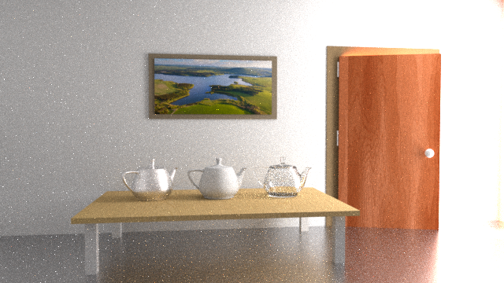

# Practical Path Guiding
## Google Summer of Code 2019 - Final Project Report
This year I was very happy to qualify for the [Google Summer of Code](https://summerofcode.withgoogle.com/) project with [Appleseed](https://appleseedhq.net/) as my host organiser. During the summer I implemented [Practical Path Guiding](https://github.com/Tom94/practical-path-guiding) a new rendering algorithm for their Open Source 3D film production renderer. My assigned mentors were François Beaune and Esteban Tovagliari.

### Rendering
Nowadays most renderers used in film productions use a technique called path tracing to calculate the realistic distribution of light in a virtual 3D scene. In simple terms a [path tracer](https://www.youtube.com/watch?v=frLwRLS_ZR0 "A short explanation video by Disney") probes the scene by extending rays from a virtual camera, reflecting rays in random directions at surface intersections until they hit a light source, at which point the transmission of energy from the light along the path back to the camera is calculated. Usually many such path probes (called samples in graphics lingo) are calculated and averaged to determine the final pixel color, an extremely time consuming process even for modern computers.

Much of the realism in modern computer graphics comes from being able to not only account for illumination from direct light sources but also for indirect light, for example light that scattered from a blue wall, illuminating nearby objects with a soft blue glow. Because nothing about the distribution of indirect light in a scene is known up front it is notoriously hard to find significant indirect light contributions only by randomly scattering rays at surface intersections, requiring many samples over many paths to determine the final pixel color.

### Practical Path Guiding
Practical Path Guiding [Müller et. al. 2017] is a novel rendering technique that can extend a regular path tracer to improve its performance with indirect light. It bulids a 5D data structure, named SD-Tree, which, as the scene is being rendered, progressively subdivides the three spatial dimensions and records 2D directional information of the incoming light at each scattering location along a path. Over many samples an increasingly more accurate approximation of the entire scene's light distribution is contained in the SD-Tree. The information about where significant indirect light is coming from at any point in the scene can be used to intelligently guide path extensions towards brighter areas rather than just relying on randomly chosen directions.

### Implementing the Project
The authors [implemented](https://github.com/Tom94/practical-path-guiding) their algorithm in [Mitsuba](https://www.mitsuba-renderer.org/) another Open Source renderer which served as a valuable reference throughout the project.

The first step of the project consisted in carefully analyzing the author's implementation which is an extension of Mitsuba's standard path tracer as well as analyzing Appleseed's path tracer to figure out how Appleseed's path tracing algorithm would need to be extended. Luckily most of the significant parts of the path guiding algorithm are contained within the SD-Tree data structure with only relatively minor additional steps having to be introduced to the standard path tracer. I implemented a mock version of the SD-Tree which still only used random directions for path extensions, then duplicated Appleseed's original path tracing code and extended it at certain key points to use my mock SD-Tree.

To verify if my extensions to the path tracer were correct I ported and slightly adapted the author's implementation to work within the target renderer. The results looked promising with certain 3D scenes dominated by indirect illumination  showing a noticable improvement in quality.

Shortly after I started work on re-implementing the SD-Tree one of the authors of the Practical Path Guiding algorithm, Thomas Müller, joined the discussion on [Appleseed's Discord server](https://discord.gg/Vcu5A7h) to assist me with helpful advice in my implementation. Thomas let me know that since the release of the original path guiding paper the algorithm had been extended with several improvements (see chapter 10 in [this document](https://jo.dreggn.org/path-tracing-in-production/2019/guiding.pdf)). With my mentor's and Thomas' help as well as his original implementation to fall back to for clarity I could finish the implementation.

### Wrapping Up with Difficulties
Because I finished the implementation rather late into the project I found myself in a race against time to properly evaluate, test and debug the project. Unfortunately what I had thought to be a straightforward integration of the algorithm within our original path tracer, proved to be a bit more complicated to get exactly right and I found myself spending much of the final week tracing down a series of bugs. At the current stage the algorithm does improve lighting in some of the scenes I tested it on. Due to the computational overhead path guiding is expected to perform worse in scenes with straightforward lighting situations, this is also the case in the author's original implementation. In one particular scene however I am not seeing any improvements, even though the author's version does show a clear improvement. This is something I will have to investigate and can hopefully solve soon.

Further there are many possibilities for improvement including making the UI parameters more user friendly, enabling checkpoint saving during rendering as is possible with standard path tracing and finding possibilities to reduce code duplication.

### Results (WIP)

### Code
Due to the implementation of the algorithm consistently evolving into its current state, breaking it up into multiple PRs would not have made much sense. All my changes are therefore included in one final [PR](https://github.com/appleseedhq/appleseed/pull/2656) which is currently awaiting review. To try the new feature out feel free to clone my fork of the Appleseed repository. The changes related to the project are in the [path_guiding branch](https://github.com/BashPrince/appleseed/tree/path_guiding) instructions to get the Appleseed codebase up and running can be found in the [Appleseed Wiki](https://github.com/appleseedhq/appleseed/wiki/Building-appleseed). Instructions for the path guiding UI settings are also included in the PR. Once my changes get merged they should be available in the following release of Appleseed which can then be [downloaded](https://appleseedhq.net/download.html) and installed more easily.
