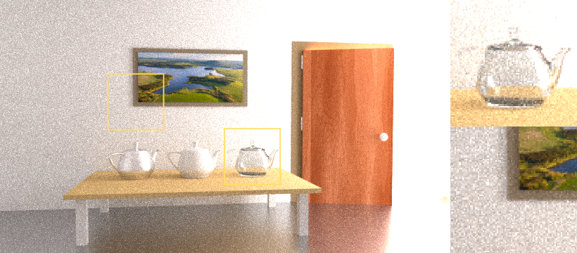
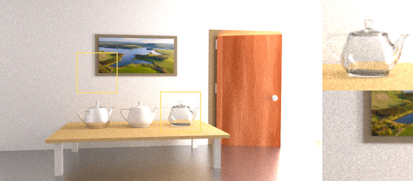
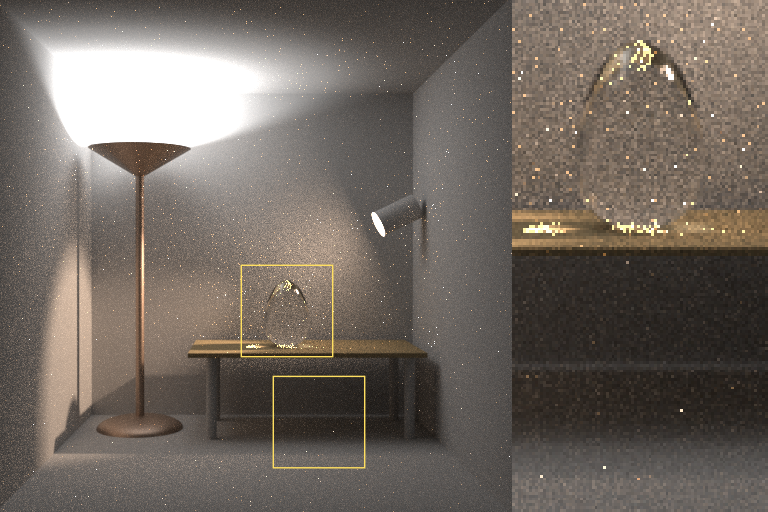
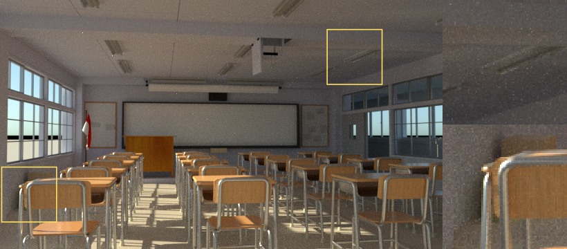

# Google Summer of Code 2019 - Final Project Report
## Practical Path Guiding
This year I was very happy to [qualify](https://summerofcode.withgoogle.com/projects/#5218774590947328 "Link to my project proposal") for the [Google Summer of Code](https://summerofcode.withgoogle.com/) project with [appleseed](https://appleseedhq.net/) as my host organiser. During the summer I implemented [Practical Path Guiding](https://github.com/Tom94/practical-path-guiding) a new rendering algorithm for their Open Source 3D film production renderer. My assigned mentors were François Beaune and Esteban Tovagliari. A pull request containing all relevant additions can be viewed [here](https://github.com/appleseedhq/appleseed/pull/2656).

### Rendering 101
 Most film production renderers today use a technique called path tracing to calculate the realistic distribution of light in a virtual 3D scene. In simple terms a [path tracer](https://www.youtube.com/watch?v=frLwRLS_ZR0 "A short explanation video by Disney") probes the scene by extending rays from a virtual camera, reflecting rays in random directions at surface intersections until they hit a light source, at which point the transmission of energy from the light along the path back to the camera is calculated. Usually many such path probes (called samples in graphics lingo) are calculated and averaged to determine the final pixel color, an extremely time consuming process even for modern computers.

Much of the realism in modern computer graphics comes from being able to not only account for illumination from direct light sources but also for indirect light, for example light that scattered from a blue wall, illuminating nearby objects with a soft blue glow. Because nothing about the distribution of indirect light in a scene is known up front it is notoriously hard to find significant indirect light contributions only by randomly scattering rays at surface intersections, requiring many samples over many paths to determine the final pixel color.

### Practical Path Guiding
[Practical Path Guiding](https://github.com/Tom94/practical-path-guiding) (PPG) [Müller et. al. 2017] is a novel rendering technique that can extend a regular path tracer to improve its performance with indirect light. It bulids a 5D data structure, named SD-Tree, which, as the scene is being rendered, progressively subdivides the three spatial dimensions and records 2D directional information of the incoming light at each scattering location along a path. Over many samples an increasingly more accurate approximation of the entire scene's light distribution is contained in the SD-Tree. The information about where significant indirect light is coming from at any point in the scene can be used to intelligently guide path extensions towards brighter areas rather than only relying on randomly chosen directions.

### Implementing the Project
The authors [implemented](https://github.com/Tom94/practical-path-guiding) their algorithm in [Mitsuba](https://www.mitsuba-renderer.org/) another Open Source renderer which served as a valuable reference throughout the project.

The first step of the project consisted in carefully analyzing the author's implementation which is an extension of Mitsuba's standard path tracer as well as analyzing appleseed's path tracer to figure out how appleseed's path tracing algorithm would need to be extended. Luckily most of the significant parts of the path guiding algorithm are contained within the SD-Tree data structure with only relatively minor additional steps having to be introduced to the standard path tracer. I implemented a mock version of the SD-Tree which still only used random directions for path extensions, then duplicated appleseed's original path tracing code and extended it at certain key points to use my mock SD-Tree.

To verify if my extensions to the path tracer were correct I ported and slightly adapted the author's implementation of the SD-Tree to work within the target renderer. The results looked promising with certain 3D scenes dominated by indirect illumination  showing a noticable improvement in quality.

Shortly after I started work on re-implementing the SD-Tree, one of the authors of the Practical Path Guiding algorithm, Thomas Müller, joined the discussion on [appleseed's Discord server](https://discord.gg/Vcu5A7h) to assist me with helpful advice in my implementation. Thomas let me know that since the release of the original path guiding paper the algorithm had been extended with several improvements (see chapter 10 in [this document](https://jo.dreggn.org/path-tracing-in-production/2019/guiding.pdf)). With my mentor's and Thomas' help as well as his original implementation to fall back to for clarity I could finish the implementation including the new improvements.

### Wrapping Up With Some Difficulties
Because I finished the implementation rather late into the project I found myself in a race against time to properly evaluate, test and debug the project. Unfortunately what I had thought to be a straightforward integration of the algorithm within our original path tracer, proved to be a bit more complicated to get exactly right and I found myself spending much of the final week tracing down a series of bugs. At the current stage the algorithm does improve lighting in some of the scenes I tested it on. Due to the computational overhead path guiding is expected to perform worse in scenes with straightforward lighting situations, this is also the case in the author's original implementation.

Some things that I wanted to accomplish within the GSoC coding period were unfortunately not finished. In the near future I would like to work on these issues:
* Enable rendering checkpoints. Our system allows saving backups during the render process to disk which can be used to resume a render later. Due to the algorithm
relying on the SD-Tree, the datastructure would also need to be saved.
* Rework the UI settings. The current controls are slightly confusing.
* Investigate methods to reduce code duplication.
* Rethink how the SD-Tree scattering events best fit into the pre-defined scattering modes appleseed uses to represent different surface scattering events (Diffuse/
Glossy/Specular).
* Create my own scenes to best highlight the strongpoints of the new algorithm.
* Numerically evaluate the results with image error metrics.

Path guiding has recently received a lot of attention with many major animation studios adopting the technique into their custom renderers. Ongoing active research
in this area produces many interesting variations ([this document](https://jo.dreggn.org/path-tracing-in-production/2019/guiding.pdf "SIGGRAPH Path Guiding in Production - Course Notes") gives detailed overview). Some of these techniques can extend the current implementation for even better performance.

### Results
The new algorithm shows clear improvements in scenes dominated by indirect lighting. These images show equal rendering time comparisons between standard path tracing
(top image) and path guiding (bottom image). The image noise results from the sampling process not having converged to an acceptably close enough estimate of the final pixel color. Novel rendering algorithms, like PPG, aim to reduce the noise by constructing paths more intelligently. All scenes shown have been retrieved from Benedikt Bitterli's [rendering resources](https://benedikt-bitterli.me/resources/) and ported to work with appleseed.

*Light in this scene enters through the door and lights the scene indirectly. (Rendered in 11 min 45 sec)*

*The two light sources in this scene are not directly visible from most points in the scene which is why it is difficult to render with path tracing. The little specs (fireflies) result from low probability paths hitting the light sources and are present in both algorithms. (Rendered in 11 min 35 sec)*

*The classroom scene shows mixed results for path guiding. The reflections from the highly reflective tables onto the ceiling show less noise for path guiding.
Other areas show no improvement or even slightly worse performance.  (Rendered in 14 min 00 sec)*

### Code
[Get the code here.](https://github.com/appleseedhq/appleseed/pull/2656)

Due to the implementation of the algorithm consistently evolving into its current state, breaking it up into multiple PRs would not have made much sense. All my changes are therefore included in one final [PR](https://github.com/appleseedhq/appleseed/pull/2656) which is currently awaiting review. To try the new feature out feel free to clone my fork of the appleseed repository. The changes related to the project are in the [path_guiding branch](https://github.com/BashPrince/appleseed/tree/path_guiding) instructions to get the appleseed codebase up and running can be found in the [appleseed Wiki](https://github.com/appleseedhq/appleseed/wiki/Building-appleseed). Instructions for the path guiding UI settings are also included in the PR. Once my changes get merged they should be available in the following release of appleseed which can then be [downloaded](https://appleseedhq.net/download.html) and installed more easily.

### Conclusion
I enjoyed working on GSoC a lot and would recommend the experience to anyone studying computer science or a related field. I will definitely continue being a part of the
appleseed community, improving my project and helping to make appleseed an even greater Open Source project. Many thanks to François Beaune and Esteban Tovagliari my
mentors who have always been quick to assist me when I needed advice. A huge thank you to Thomas Müller, author of the path guiding algorithm, for assisting me throughout the project. Many thanks also to Sebastian Herholz who supplied me with additional ideas for further improvements that I will hopefully be able to include in the near future.